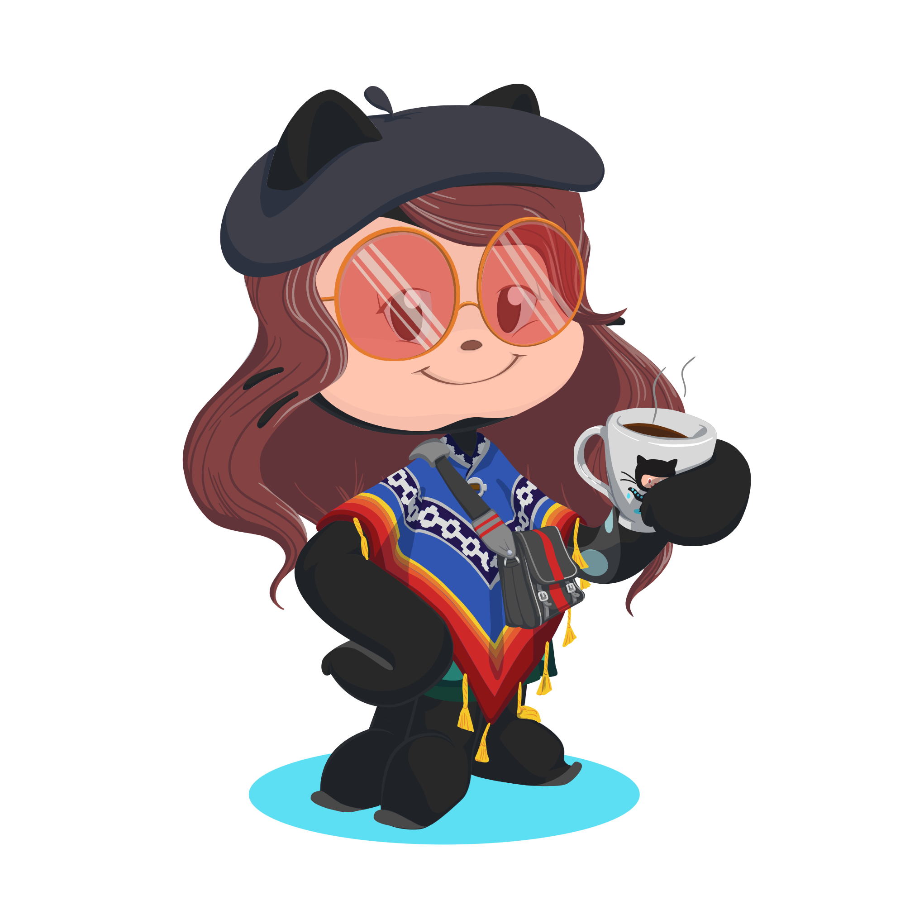

# Hello, I'm Fernanda!

    <b>Backend Developer | Software Engineering Student</b>
     

### Tech Stack & Skills
**Languages:** 

 
  

**Frameworks:** Spring Boot, FastAPI, Django

   
    
    

**Concepts:** RESTful APIs, Backend Architecture, Object-Oriented Programming

### What I'm up to
* Working at Inatel Competence Center.
* Finishing my degree in Software Engineering.
* Building my portfolio with personal projects to showcase my backend skills.

### Let's connect!

   

